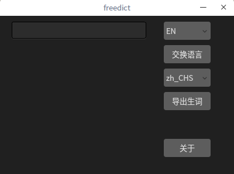
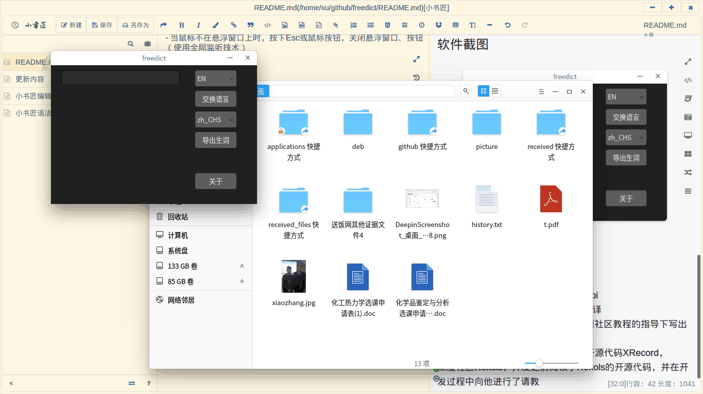
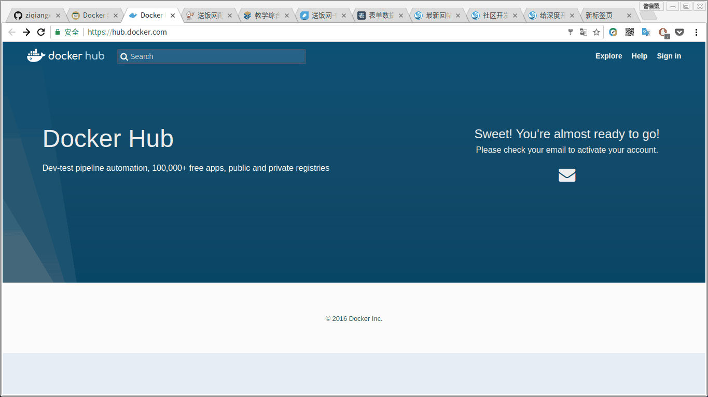

freedict(原名opendict，后来在打包的时候发现软件仓库有同名，遂改之)当前最新版本2017-3.0

### 开发背景    
学习Qt和Deepin系统下软件的开发，与此同时学习其他的计算机技术，需要阅读英文资料。Google浏览器的翻译插件和深度用户社区的Rekols-dict都很好用，但是我觉得还不够，需要一个记录查询历史的功能，以便日后复习，这样对英语水平的提高是有帮助的。后来发现实际上已经有了这样一款应用——百合词典，但是我觉得使用体验还不够好，一些细节设计得不是很到位。    

### 发行注记
二进制安装包在本仓库deb目录下      
- 2017-3.0[下载](https://github.com/ziqiangxu/freedict/raw/master/deb/freedict_v2017-3.0_amd64.deb)    
1.新增单词本管理功能；    
2.应用只能创建一个实例；    
3.其他的一些小调整。 
- 2017-2.0[下载](https://github.com/ziqiangxu/freedict/raw/master/deb/freedict_v2017-2.0_amd64.deb)     
专为Deepin平台开发，欢迎各位大佬移植，只需要把相关控件修改为Qt原生控件就可以
- 2017-1.0[下载](https://github.com/ziqiangxu/freedict/raw/master/deb/freedict_v2017-1.0_amd64.deb)     
Linux平台通用        

### 软件截图
主窗口    
    
管理生词
    
屏幕选词

### 致谢    
有道词典，本项目使用了有道的翻译api    
Google,本项目调用了Google的网页翻译    
qt开源社区，第一个Qt程序是在Qt开源社区教程的指导下写出来的    
深度科技王勇，本项目使用了王勇的开源代码XRecord，    
深度社区Rekols，开发之前阅读了Rekols的开源代码，并在开发过程中向他进行了请教    
感谢开源运动，让我可以很容易地阅读他人的代码，学习到了这样有趣的技术！    
